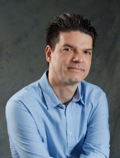

---
# Feel free to add content and custom Front Matter to this file.
# To modify the layout, see https://jekyllrb.com/docs/themes/#overriding-theme-defaults

layout: default
---

# Lecturers at the Summer School #

**Note to the lecturers:** we have been notified that some people were contacted by companies such as Traveller Point concerning travel arrangements. Any offers of this kind are spam and should be ignored!

### Benedikt Ahrens ###
### Steve Awodey ###

### Andrej Bauer ###

Andrej Bauer is a professor of computational mathematics at the Faculty of Mathematics and Physics of the University of Ljubljana. In 1994 he received his Sc.B. in Mathematics from Ljubljana, and in 2000 he received his PhD in Pure and Applied Logic from Carnegie Mellon University under the supervision of Dana S. Scott. In 2001, he spent a semester at the Mittag-Leffler Institute in Stockholm, Sweden. In 2012, he was a fellow at the Institute for Advanced Study, where he contributed to the development of homotopy type theory. Bauer’s work spans foundations of mathematics, constructive and computable mathematics, type theory, homotopy type theory, and mathematical principles of programming languages. He is an author of the book “Homotopy Type Theory: Univalent Foundations of Mathematics” and the initiator of the HoTT library, an extensive formalization of homotopy type theory in the Coq proof assistant. He is also known for his seminal work on programming with algebraic effects and handlers. Lately he has been working on type theory and the design of proof assistants.

### Yves Bertot ###

Yves Bertot has been a research scientist at Inria since 1992.  He
specialized in proofs in type-theory, studying in turn programming
language properties (with a publication at Tapsoft in 1995 with
R. Fraer, Lernet Alfa Summer School 2009, Book in Honour of Gilles
Kahn 2009), Computational Geometry (TPHOLs 2001), User Interfaces for
Theorem Proving (JSC 1998, with L. Théry), Exact Real number
computation and co-inductive types (Mathematical Structures in
Computer Science 2007), mathematical computation and interactions with
computer algebra (Mathematical Structures in Computer Science 2011,
with A. Mahboubi and F. Guilhot, JAR 2017, with L. Rideau and
L. Théry).  He wrote an introductory book on the coq system that was
published in 2004.  He participated to a few landmark results of
formally verified software and mathematical results, like Compcert
(Types'04, with B. Grégoire and X. Leroy) and the machine-checked
proof of the odd order theorem (ITP 2013, with G. Gonthier and team).
Recent work has concentrated on proofs at the interface of analysis
and algebra and their formal verification in Coq (CPP'16, formal proof
of transcendence for e and pi as an application of Multivariate and
Symmetric Polynomials, with S. Bernard, L. Théry, and P.-Y. Strub,
JAR'17, Distant Decimals of PI, with L. Rideau and L. Théry).  Current
work is concerned with trajectory computation and formal proof of
absence of collision.

### Thierry Coquand ###

### John Harrison ###

John Harrison is a Senior Principal Applied Scientist in the
  Automated Reasoning Group at Amazon Web Services, where he has among
  other things worked on a library of verified arithmetic for
  cryptographic applications. He received his PhD from the University of
  Cambridge in 1996 and has worked in both academia and industry on a
  variety of topics in automated theorem proving, formal verification
  and the design of numerical software. He is the primary developer of
  the HOL Light interactive theorem prover and author of the textbook
  "Handbook of Practical Logic and Automated Reasoning".

### Angeliki Koutsoukou-Argyraki ###

Angeliki Koutsoukou-Argyraki is a mathematician working at the
Computer Laboratory of the University of Cambridge.

### Nikolai Kudasov ###
### Conor McBride ###
### Leonardo de Moura (online lecture) ###
### Paige Randall North ###
### Emily Riehl ###

Emily Riehl is a Professor of Mathematics at Johns Hopkins University in Baltimore working in higher category theory and homotopy type theory. She has recently embarked on a collaborative project to formalize aspects of infinity-category theory in the computer proof assistant rzk. This proof assistant, developed by Nikolai Kudasov, is based on the simplicial type theory introduced in a joint paper with Mike Shulman, a formal system which has semantics in the category of simplicial objects in any infinity-topos.

### Michael Shulman (online lecture) ###

